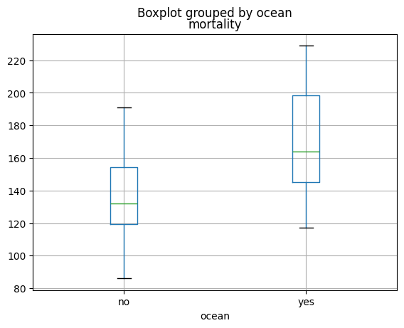
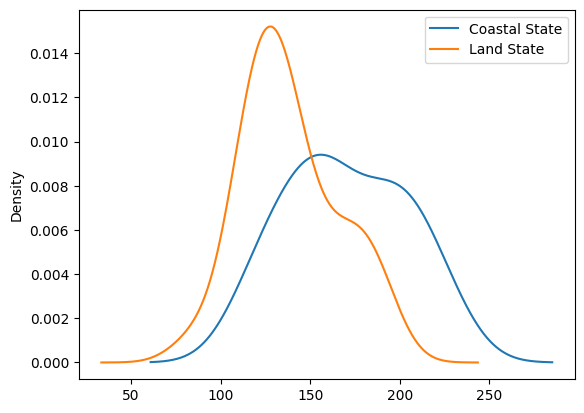
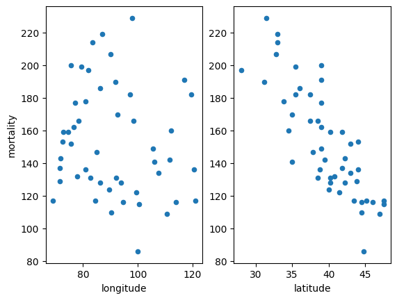
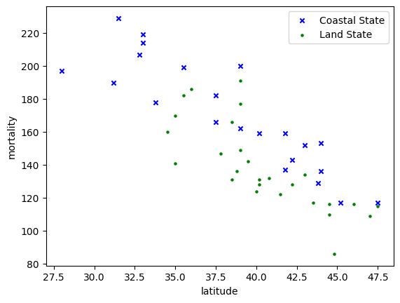

# Supporting a Data Analysis with Geographical plots

This jupyter notebook is the python version of the R analysis done in the *Chapter 2 - Malignant Melanoma in the USA*  
of *A Handbook of Statistical Analysis Using R* written by T. Torsten & B.S. Everitt (3r edition).

## Malignant Melanoma in the USA

### The Dataset

This dataset contains the mortality rate for this disease per state in the USA.  
The `latitude`, `longitude` of the state is also available, as long as an indicator `ocean`  
that says if the state is by an ocean.

### Correlation with proximity to an ocean

Plots by `ocean` indicator show a clear correlation: the closer to an ocean, the higher the mortality rate.  

### Correlation with latitude

The scatter plot by `latitude` shows a clear negative correlation `latitude-mortality`.  

### Plotting the dataset on a US map shows clearly the double correlation

We can clearly see that the mortality rate increases with latitude and proximity to an ocean.  
*NB: here, 'ocean' means that the state is by an ocean.*

